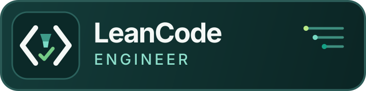
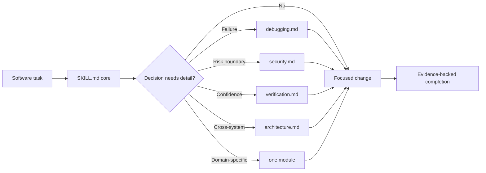

<div align="center">

<p><strong>Correct code. Secure decisions. Only the context that matters.</strong></p>
<p>


<br>


</p>
</div>

LeanCode Engineer is an open-source Agent Skill for disciplined software engineering. Its tiny entrypoint routes an agent to focused references and domain modules only when they change the next decision.

The project optimizes in this order:

> **Correctness → Security → Verification → Minimal Change → Context Efficiency → Brevity**

Token savings are a constraint, never a reason to skip evidence or weaken safeguards.

## Why it exists

Large “do everything” prompts consume context on every task. LeanCode Engineer keeps the shared operating contract in `SKILL.md`, then uses progressive disclosure for debugging, security, architecture, verification, and optional domain modules.

- Small, durable core that remains useful across stacks.
- Specialist references loaded only for relevant decisions.
- Risk-based verification with honest reporting of gaps.
- Single-agent default; delegation and Agent Teams are selective and optional.
- No service, API key, telemetry, or runtime package required.

## Quick start

### Try as a Claude Code plugin

From this repository:

```bash
claude --plugin-dir .
```

Then invoke `/lean-code-engineer:lean-code-engineer`, or describe a coding task and allow automatic activation.

### Install as a personal Claude Code skill

```bash
./scripts/install.sh
```

The installer defaults to `~/.claude/skills/lean-code-engineer`, refuses to overwrite an existing install, and preserves the old directory as a timestamped backup when `--force` is explicitly used.

```bash
./scripts/install.sh --dry-run
./scripts/install.sh --target codex
./scripts/install.sh --dest /absolute/custom/skills/lean-code-engineer
```

See [installation](docs/installation.md) and [compatibility](docs/compatibility.md) for supported and experimental paths.

## How progressive disclosure works



The complete design is documented in [architecture](docs/architecture.md).

## Example: a routed decision

Illustrative walk-through, not a captured session:

```text
Task: "This endpoint sometimes 500s under load — fix it."

SKILL.md core        → recognizes a failure, not a feature request
  → references/debugging.md   → reproduce, isolate, root-cause before patching
  → references/verification.md → the fix ships with a test that reproduces
                                   the failure and now passes

Context loaded: core + 2 references.
Context skipped: architecture.md, security.md, and every domain module —
none of them change this decision.
```

Only the references a decision actually needs get loaded; everything else stays
out of context.

## Repository map

```text
SKILL.md Lean entrypoint and router
references/ Conditional engineering playbooks
modules/ Optional domain guidance
scripts/ Installer, validator, router, benchmark
tests/ Standard-library behavioral checks
examples/ Realistic routing examples
docs/ Architecture, compatibility, security, release docs
agents/openai.yaml Codex-compatible UI metadata
.claude-plugin/ Claude Code plugin manifest
.github/ CI and community health files
assets/ Logo, icon, and GitHub artwork
```

## Validate and benchmark

Python 3.9+ is needed only for contributor tooling:

```bash
./scripts/validate.sh
./scripts/test.sh
./scripts/benchmark.sh --check
```

The benchmark reports estimated context cost and route-specific savings. It is a structural proxy, not a claim about model billing or answer quality; see [benchmark methodology](docs/benchmarking.md).

## Project status

`v0.1.0` is the first locally validated foundation. Claude Code is the primary host. Codex metadata and installation are included as an experimental adapter; Cursor and OpenCode remain roadmap targets until their adapters and compatibility tests are implemented.

## Contributing and security

Start with [CONTRIBUTING.md](CONTRIBUTING.md). Report suspected vulnerabilities through the private process in [SECURITY.md](SECURITY.md), not a public issue.

Before publication, apply the reviewed defaults in [GitHub repository setup](docs/github-setup.md).

## Built by a practitioner

LeanCode Engineer is the discipline [ALJANEF](https://github.com/AL-JANEF) — a
solo founder building AI-native ventures for Gulf markets — holds his own
production code to, packaged as a reusable skill. More projects on the
[profile](https://github.com/AL-JANEF?tab=repositories).

## License

[MIT](LICENSE) © 2026 ALJANEF.
