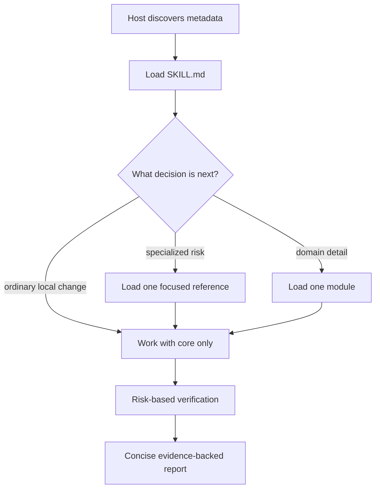

# Architecture

## Design goal

LeanCode Engineer should improve software-engineering decisions without becoming a large prompt that taxes every task. The architecture separates stable cross-cutting invariants from conditional detail.

## Layers

1. **Discovery metadata** — name and description let a host activate the skill cheaply.
2. **Core contract** — `SKILL.md` defines priorities, a short work loop, routing, and non-negotiable guardrails.
3. **Specialist references** — cross-cutting playbooks loaded for a decision such as debugging or security.
4. **Domain modules** — stack-area guidance loaded for frontend, database, cloud, and related work.
5. **Deterministic tooling** — validation and benchmarks check structure without asking a model to interpret itself.
6. **Host adapters** — plugin and UI metadata remain outside the portable core.

## Dependency rules

- The core may link to references and the module catalog.
- A reference must not require every other reference to be useful.
- A module may point back to a cross-cutting reference but must not redefine the priority order.
- Host adapters may consume the portable core; the portable core must not depend on a host adapter.
- Contributor tooling must not be required at skill runtime.

## Key decisions

### Single skill, not a permanent agent team

Agent Teams can multiply coordination and context costs. The skill defaults to one agent and treats delegation as an optimization for genuinely independent work. The orchestration reference defines an explicit selection gate.

### Standard-library tooling

Python and shell checks avoid dependency installation and supply-chain surface. A future dependency must have a measured benefit, an owner, and an update policy.

### Structural benchmark, not billing claim

Character-based token estimation is deterministic and model-agnostic enough for regression gating. It cannot predict provider billing, cache behavior, or output quality, so results are labeled estimates.

### Portable frontmatter

The root skill uses fields from the Agent Skills specification accepted by Claude Code. Claude-only behavior lives in plugin metadata or documentation, reducing lock-in.

## Extension contract

New references or modules must be independently useful, reachable from a routing decision, tested by at least one route, and cheaper than adding the same guidance to the core. See [CONTRIBUTING.md](../CONTRIBUTING.md).
